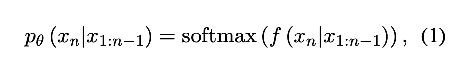
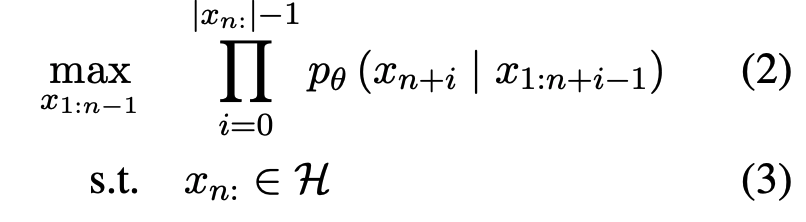
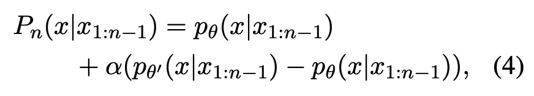

## Introduction 

This is a note for some basic concepts in distributed system.

## Table of Contents

- [Introduction](#introduction)
- [Table of Contents](#table-of-contents)
- [RPC](#rpc)
  - [Key Points](#key-points)
- [Primary-Backup Replication](#primary-backup-replication)
  - [Failure model](#failure-model)
  - [Replicate Methods](#replicate-methods)
    - [State transfer](#state-transfer)
    - [Replicated state machine](#replicated-state-machine)
  - [Replication Layer Choice](#replication-layer-choice)
    - [Virtual Machine](#virtual-machine)
    - [Why Virtual Machine?](#why-virtual-machine)
  - [Design Details](#design-details)
    - [How it runs with no failure](#how-it-runs-with-no-failure)
    - [Logging](#logging)
    - [Output requirement](#output-requirement)
    - [Failure Detection](#failure-detection)
- [MapReduce](#mapreduce)
- [Chord](#chord)
  - [Consistent Hashing](#consistent-hashing)
  - [InterNode Communication](#internode-communication)
    - [Finger table](#finger-table)
  - [New Node Join](#new-node-join)
    - [Step1: Initialize Finger Table of New Node](#step1-initialize-finger-table-of-new-node)
    - [Step2: Update Finger Table of Existing Nodes](#step2-update-finger-table-of-existing-nodes)
    - [Step:3 Transfer Keys](#step3-transfer-keys)
    - [Stability During Node Join](#stability-during-node-join)
    - [Performance during unstable period](#performance-during-unstable-period)
  - [Node Failure Handling](#node-failure-handling)
- [CDN](#cdn)
  - [Reverse Proxy](#reverse-proxy)
  - [CDN Architecture](#cdn-architecture)
    - [CDN Setup](#cdn-setup)
    - [CDN Process](#cdn-process)
    - [Request Mapping](#request-mapping)
  - [Performance OPtimization for static content](#performance-optimization-for-static-content)
  - [Performance Optimization for dynamic content](#performance-optimization-for-dynamic-content)
- [Raft](#raft)
  - [Existing fault tolerance](#existing-fault-tolerance)
    - [Stable leader: handling leader failure](#stable-leader-handling-leader-failure)
    - [Network partition problem](#network-partition-problem)
  - [Theorem Discussion](#theorem-discussion)
    - [Fischer-Lynch-Patterson](#fischer-lynch-patterson)
    - [CAP Theorem](#cap-theorem)
    - [Quorum-based Consensus](#quorum-based-consensus)
  - [RSM Consensus with 5 assumptions](#rsm-consensus-with-5-assumptions)
    - [Early Attempts](#early-attempts)
  - [Raft Overview](#raft-overview)
    - [Normal Operation on rsm system using Raft](#normal-operation-on-rsm-system-using-raft)
    - [State of Replicas](#state-of-replicas)
      - [Leader:](#leader)
      - [Followers:](#followers)
      - [Candidate:](#candidate)
    - [Subproblems](#subproblems)
      - [Leader election](#leader-election)
      - [Log replication](#log-replication)
      - [Safety (State Machine Safety)](#safety-state-machine-safety)
      - [other details](#other-details)
    - [RPCS used in Raft](#rpcs-used-in-raft)
    - [Leader Election](#leader-election-1)
    - [Leader: maintain log consistency](#leader-maintain-log-consistency)
    - [Election restriction](#election-restriction)
    - [Committing entries from previous terms](#committing-entries-from-previous-terms)
    - [Correctness of Raft](#correctness-of-raft)
    - [Cluster membership changes](#cluster-membership-changes)
    - [Non-volatile memory](#non-volatile-memory)
- [Zookeeper](#zookeeper)
  - [Coordination Service](#coordination-service)
  - [Data Model](#data-model)
  - [Zookeeper Structure](#zookeeper-structure)
    - [Two types of files](#two-types-of-files)
    - [Operations on znodes](#operations-on-znodes)
  - [Linearizability](#linearizability)
    - [Sequential Consistency, Eventual Consistency and Strong Consistency](#sequential-consistency-eventual-consistency-and-strong-consistency)
    - [Raft provides linearizability](#raft-provides-linearizability)
    - [Zookeeper's guarantee](#zookeepers-guarantee)
  - [Replicated Database](#replicated-database)
  - [How is FIFO client ordering ensured](#how-is-fifo-client-ordering-ensured)
  - [Read/Write Guarantee](#readwrite-guarantee)
  - [Application of Zookeeper](#application-of-zookeeper)
    - [Simple locks](#simple-locks)


## RPC

- Calls a procedure at a different address space
- Transfer of both control and data across a communication network

### Key Points

- stubs: automatically generated by a program called lupine
from interface module
  - An interface module is a list of procedure calls together with the types of their arguments and results
  - Today, we call this “interface module” interface description and the corresponding language, interface description language, e.g., protobuf

- Binding: Check to make sure that the procedure descriptions match
between the client and the server

## Primary-Backup Replication

### Failure model

- Fail-stop faults: node/parts/processes stop executing but do not exhibit Byzantine behavior
  - Stop executing
  - Detectable
  - No Byzantine behavior 
  - Hardware failure: power outage, CPU overheating, network cable tripped
  - Kernel panic

- Byzantine faults: arbitrary behavior
  - Bugs, adversaries, attacker
  - Malicious: The node may attempt to disrupt the entire system intentionally.
  - Complexity: These faults are among the most challenging to handle as they require the system to tolerate the worst-case scenario.
  - Needs other methods: Byzantine fault tolerance, blockchain

- Higher-scale deployment -> more failures -> less reliable
  - Needs to assume different replicas fail independently


### Replicate Methods

#### State transfer

- Primary sends replicas the state of the primary

#### Replicated state machine

  - State changes are **“mostly” deterministic**
  - Primary sends replicas the **external events**
  - External events are smaller than states in terms of size


  - Replicas must agree on a sequence of actions.
    - A replicated log or ledger of requests (commands, ops).
  - **Strong ordering condition**: important rule to ensure consistency and convergence
    - Necessary for convergence: ensure all replicas end up in the same state
    - Sufficient for convergence: for a deterministic program, if all replicas start in the same state and execute the same sequence of requests, they will end up in the same state.

  - How to ensure a sequence?
    - Consensus Algorithm
    - Linearizability and Sequential Consistency
    - Log Replication
    - Timestamps
    - Leader-Based Architecture
    - Distributed Locks
    - Conflict-Free Replicated Data Types (CRDTs)

### Replication Layer Choice

- Application-level replication
  - Need careful application designs
- Virtual Machine
  - make non-fault-tolerant application become fault-tolerant in a transparent way

#### Virtual Machine

- Hypervisor: VMM
  - Slide a hypervisor within/underneath the host OS kernel. (New OS layer: also called virtual machine monitor VMM)
  - Run multiple guest VM instances on a shared computer
    - Each VM is a sandboxed/isolated context for any entire OS
    - VM instance “looks the same” to guest OS as a physical machine
  - 

#### Why Virtual Machine?

- Sharing resources
- Isolation between different workloads
- able to Run a different OS for legacy applications
- checkpoint and migration

### Design Details

- low overhead
  - runtime performance
  - low network B/W usage
- Easy to use
  - Automated replication and failure recovery
- 
- 
- Ideal Status:
  - If two deterministic state machines are **started in the same initial state** and provided the exact **same inputs in the same order**, then they will go through the same sequences of states and produce the same outputs

#### How it runs with no failure

- Keep primary and backup in sync
- Log Inputs and non-deterministic events
  - Network packets
  - Interrupts
  - Special operations (e.g., read clock time)
  - Assumption: VM has a single core
- Primary can output to the client
- Backup's output is dropped at the hypervisor

- if the backup VM ever takes over after a
failure of the primary, the backup VM will continue executing in
a way that is entirely consistent with all outputs that the primary
VM has sent to the external world
- An external observer cannot “sense” the failure of the primary


#### Logging
- Inputs will be logged
  - Network packets received
- Non-deterministic events will be logged
  - log the exact instruction at which the event occurred
  - requires support from hardware
  - Special instructions' return value must be logged

#### Output requirement

- Output rule: the primary VM may not send an output to the external world, until the backup VM has received and acknowledged the log entry associated with the operation producing the output
- Delay response from the primary to the client
  - The backup must have all the information (i.e., log entries) needed to generate the output that the primary will generate


- Output Rule does not say anything about
stopping the execution of the primary VM. We need only delay the sending of the output, but the VM itself can continue execution

- Output rule: a **relaxation** from truthy synchronized states
  - allows for an efficient implementation of a primary-backup replication system

#### Failure Detection

- Heartbeat messages between primary and backup
- Split Brain Problem: What if both primary and backup believe that they are the primary?
  - Test-and-set on **shared storage** (similar to a acquire lock)
  


## MapReduce

Real dull stuff, simply skip it.

## Chord

Peer-to-peer distributed protocol

- System model
  - Load balancing: data is evenly distributed across node based on a hash function
  - Decentralization: no node is more important than any other
  - Scalability: operations should have logarithmic cost with respect to the number of nodes
  - Availability: handle node joins and failures
  - Flexible naming: no constraints on the structure of keys
- What Chord is for
  - lookup (Key) -> IP address
  - Notifies applications change of set of keys the node is responsible for
- What's not Chord's responsibility
  - Authentication, caching, replication, user-friendly naming
- Example of Chord in Software
  

### Consistent Hashing

Chord uses consistent hashing to assign keys to nodes

- `N` nodes and `K` keys
  - each node is responsible for at most `(1+ε)K/N` keys
  - node joins or leaves requires `O(K/N)` key changes hands
  - How to reduce `ε`?
    - Increase the number of virtual nodes
    - More effective load balancing
    - Better hash function

### InterNode Communication

Node receives a message, it will forward the message to the node responsible for the key

- Choice: Every node knows of all other nodes
  - `O(N)` Routing table size
  - Lookup time: `O(1)`
- Choice: Every node knows its successor in the ring
  - Routing table size: `O(1)`
  - Lookup time: `O(N)`
- Chord: Every node knows `O(log N)` other nodes
  - pointers in the routing table point to the successor node of `2^i`-th position in the ring
  - 
  - 

#### Finger table

- 
- Theorem 2: with high probability, the number of nodes that must be contacted to find a successor in an N-node network is
`O(log N)`

### New Node Join

- New node `N` joins the network
  - Initialize the predecessor and fingers of node n
  - Update the fingers and predecessors of existing nodes to reflect the addition of n
  - Notify higher layer software so that it can transfer state associate with keys that node n is now responsible for

#### Step1: Initialize Finger Table of New Node


- utilize the existing node to look up the new node's finger table

#### Step2: Update Finger Table of Existing Nodes


- recursively update the finger table of existing nodes to reflect the addition of the new node

#### Step:3 Transfer Keys

- Transfer keys to the new node from successor node

#### Stability During Node Join

- Approach:
  - Predecessors and successors are maintained
  - Fingers can be updated later

- Reason: 
  - Theorem 4: once a node can successfully resolve a given query, it will always be able to do so in the future

  - Theorem 5: at some time after the last join, all successor pointers will be correct.

#### Performance during unstable period

- Theorem 6: If we have a stable network of N nodes, adding another N nodes without finger tables, then lookup will still take `O(log N)`.

- The speed of updating finger tables only need to match the speed of growing network to double in size.

### Node Failure Handling

- Node failure: a node is no longer reachable
- Approach:
  - Use the successor list to detect node failure
    - Each node keeps a `r` list of its successors
    - return the first live node in the successor list for find_successor query
    - Theorem 7: with high probability, find_successor query will return the closest living successor
    - Theorem 8: with high probability, find_successor query will return in `O(log N)`
  - Heartbeat messages

## CDN

origin server -> CDN -> client

- origin server: the server that hosts the original content
- edge server: the server that hosts the cached content and is closer to the client
- CDN: a network of edge servers that cache content


### Reverse Proxy

- A server that sits between the client and the origin server
- The client sends requests to the reverse proxy, which forwards the request to the origin server
- The reverse proxy caches the response from the origin server and returns it to the client
- Nginx, Apache, Varnish
  - load balancing
  - caching static content
  - SSL termination
  - safeguarding the origin server

- CDN can be seen as a network of reverse proxies
  - Proxy server: edge server/ content server, "close to the eyeballs"
  - Customer scale lease capacity from CDNas needed, "pay as you grow"
  - Help absorb unexpected load from “flash crowds”/DDOS attacks
  - Low capital expense, operational expense scales with delivered load


### CDN Architecture

#### CDN Setup

- URL rewriting: change the URL of the request to point to the CDN
- DNS: resolve the domain name to the CDN
- Anycast: 
  - IP -> Server, route the request to the nearest edge server
  - Allow multiple servers to share the same IP address


#### CDN Process


- Anycast part:
  - process 5-7: global DNS -> regional DNS
- CNAME:
  - process 1-2: give back ALIAS to the client
  - 

#### Request Mapping

- Request mapping: map the request to the optimal edge server
  - Dynamically: based on the current load of the edge server
  - 
  
### Performance OPtimization for static content

- Tiered distribution
  - When an edge cluster does not have a piece of request content in cache, it retrieves that content from its parent cluster rather than the origin server
  - Reduce the number of network connections the origin server needs to handle

- Overlay network for live streaming
  - Using a cluster of servers call **entrypoints** to ensure data stream is reliably delivered to edge servers

### Performance Optimization for dynamic content

- Distribuing application to the edge
  - Allow developers to rent computation power from edge servers
  - Content aggregation/transformation
  - Static databases
  - Data collection

## Raft

### Existing fault tolerance
- VM fault tolerance
  - Primary-backup replication
- MapReduce
  - Rerun failed tasks on different workers
  - Requires a master to detect failed workers and initiate rerun of failed tasks

#### Stable leader: handling leader failure

- Leader sends a message to followers at regular intervals, even if there are no new op requests (heartbeat or ping or keepalive)
- Followers set timers. If timer fires with no heartbeat, abandon the leader and initiate leader election

#### Network partition problem

- Network partition: a network is split into two or more parts, and the parts cannot communicate with each other
- Could lead to multiple leaders
- Split brain problem: two parts of the network believe they are the leader

### Theorem Discussion

#### Fischer-Lynch-Patterson

FLP: An asynchronous distributed system can be safe or live, but not both.
- Safety property: **agreement**/**consistency**
  - Insist that "Nothing bad ever happens"
- Liveness property: **termination**/**progress**
  - Insist that "Something good eventually happens"
  - Availability can be seen as a liveness property (unbounded response time -> not available)
- No consensus can be guaranteed in an asynchronous system in the presence of failures
- Intuition: a “failed” process might just be “slow”, and can rise from the dead at exactly the wrong time

#### CAP Theorem

- Consistency: all nodes see the same data at the same time
- Availability: a guarantee that every request receives a response about whether it was successful or failed
- Partition tolerance: the system continues to operate despite network partitions
- CAP theorem: 
  - a distributed system can only guarantee two of the three properties
  - It is impossible to implement an atomic data object that is available
  - Proof: Partition the network. A write on one side is not seen by a read on the other side, but the read must return a response

#### Quorum-based Consensus

In order to lead and serve client requests, a leader L1 must continually receive votes from a majority of the group (a quorum)
  - The quorum rule protects consistency (C) in a network partition
    - at most one connected subgroup can serve requests.
  - it sacrifices availability (A). 
    - If a majority of replicas fail, it might be safe for the survivors to serve clients. 
    - But they must not, because this case is indistinguishable from a network partition. 


### RSM Consensus with 5 assumptions

1. Deterministic application service
   - all nodes run the deterministic state machine, all replicas will end up in the same state if they start in the same state and execute the same sequence of requests
  
2. Known configuration: fixed group of N=2f+1 replicas
   - f is the number of faulty replicas
   - N is the total number of replica nodes
     - 2f+1 is the minimum number of replicas needed to tolerate f failures
     - there should be at least f+1 correct replicas to make progress
   - reason: with 2f+1 replicas, a majority of replicas is f+1, which is enough to make progress as quorum-based consensus requires
  
3. Ready quorum: Available only if at most f failures and majority (f+1) are up and connected. Else keep trying!
   - system is available only if a majority of replicas are up and connected  
   - if not enough replicas are up, consistency cannot be guaranteed
  
4. Fail-stop faults: a failed replica is silent. Replicas run the same program and are faithful to it. Net may delay.
   - assume that replicas do not exhibit Byzantine behavior
   - Replicas run the same program and will obey the same protocol when they are not faulty
   - Protocol should be designed to handle network delays
  
5. Smart clients. On fail-over, clients switch and resync to the new leader. No lost/duplicate requests or responses.
   - Clients must be able to detect leader switch and resync to the new leader

#### Early Attempts

- Paxos
- Viewstamped Replication
  

### Raft Overview

Raft is a consensus algorithm for managing a replicated log

#### Normal Operation on rsm system using Raft

  - Replicated log -> replicated state machine
    - All servers execute same commands in same order
  - Consensus module ensures proper log replication
  - System makes progress as long as any majority of servers are up
  - Failure model: fail-stop (not Byzantine), delayed/lost messages

#### State of Replicas

##### Leader: 
accepts client requests, replicates log entries, and sends heartbeats to followers

- Upon election: 
  - send initial empty `AppendEntries` RPCs (heartbeat) to each server; 
  - repeat during idle periods to prevent timeout and start new elections

- If command received from client
  - append entry to local log
  - Use `AppendEntries` RPC to replicate log entry to followers
  - When responded by majority, commit entry and apply to state machine
  - respond after entry applied to state machine

- Log management 
  - log replication:
    - check follwers' `nextIndex`, if last log index is bigger than `nextIndex`, send `AppendEntries` RPC with log entries starting at `nextIndex`
      - success: update `nextIndex` and `matchIndex` for the follower
      - fail (inconsistency): decrement `nextIndex` and retry, until `nextIndex` is consistent with the leader
  - log entry commit:
    - `N` > current `commitIndex`
      - `commitIndex` is the highest log entry index that the leader has committed
    - a majority of `matchIndex` ≥ `N`
      - `matchIndex` is the highest log entry index that the follower has replicated
    - the term of the log entry at `N` is the current term
      - ensure that the log entry is replicated in the current term 
    - How to commit:
      - update `commitIndex` to `N`

##### Followers: 

replicate log entries, respond to requests from leader, and vote in elections

- If election timeout elapses without receiving AppendEntries RPC from current leader or granting vote to candidate: convert to candidate

##### Candidate: 
- Nominate itself for leader, requests votes from followers, becomes leader if it receives votes from a majority of the group


- term: a logical clock that represents the current leader
  - leader election: increment term
  - leader change: increment term
  - term is used to ensure that only one leader is elected in a given term

#### Subproblems

##### Leader election

a new leader must be chosen when an existing leader fails

##### Log replication

the leader must accept log entries from clients and replicate them across the cluster, forcing the other logs to agree with its own.

##### Safety (State Machine Safety)
Property: if any server has applied a particular log entry to its state machine, then no other server may apply a different command for the same log index

##### other details


#### RPCS used in Raft

- AppendEntries RPC
  - Leader sends log entries to followers
  - Followers respond with success or failure
  - also used as heartbeat
- RequestVote RPC
  - Candidate requests votes from followers
  - Followers respond with vote or no vote
- Idempotent: both RPCs are idempotent

#### Leader Election

- To begin an election, a follower increments its current term and
transitions to candidate state. 
- It then votes for itself and issues RequestVote RPCs in parallel
to each of the other servers in the cluster
- A candidate continues in this state until one of three things
happens: 
  - (a) it wins the election
  - (b) another server establishes itself as leader (sending out heartbeats)
  - (c) a period of time goes by with no winner.

- Each server will vote for **at most one** candidate in a given term,
on a **first-come-first-served** basis
- Once a candidate wins an election, it becomes leader. It then sends **heartbeat messages** to all of the other servers to establish its authority and prevent new elections.
- To prevent split votes, election timeouts are chosen randomly
from a fixed interval (e.g., 150-300ms).
  - This way, servers will time out at different times, preventing them from starting elections as candidates at the same time
  - Hopefully, one follower time out at a time

#### Leader: maintain log consistency

- The leader maintains a nextIndex for each follower, which is the index of the next log entry the leader will send to that follower. 
  - When a leader first comes to power, it initializes all nextIndex values to the index just after the last one in its log.
- If a follower's log is inconsistent with the leader's, the AppendEntries consistency check will fail in the next AppendEntries RPC
  - After a rejection, the leader decrements nextIndex and retries the AppendEntries RPC.

#### Election restriction

Problem: What if the candidate don't have the committed log entries? (if the candidate becomes the leader, it may flush others' committed log entries)

- Goal: A candidate wins the election unless its log contains all committed entries
- A RequestVote RPC includes information about the candidate's log, and the voter denies its vote if its own log is more up-todate than that of the candidate.
  - idea here: a committed log entry is replicated in a majority of servers ( at least f+1 servers). If a candidate need f+1 votes to win the election, these add up to 2f+2, which means at least 1 voter will have the committed log entry.

#### Committing entries from previous terms

- Delay commit for log entries from previous terms for new leader
  - If a leader is elected and finds that log entries from previous terms are not committed, it can't commit them immediately even if they are replicated in a majority of servers
  - New leader must wait until it has replicated a log entry from its own term before committing log entries from previous terms

#### Correctness of Raft

Based on the Election restriction and Committing entries from previous terms rule, raft ensures that a committed log will always show up in the leader's log eventually

#### Cluster membership changes

- Log entries are replicated to all servers in both configurations
- Any server from either configuration may serve as leader
- Agreement (for elections and entry commitment) requires separate majorities from both the old and new configurations

#### Non-volatile memory

- Follower should persist its vote for a candidate 


## Zookeeper

- When using an RSM library(like raft)
  - very complex to use
  - need to rethink about whether the application is actually a state machine, like how to integrate

- Using a coordination service
  - Zookeeper

Raft: replicating computation
Zookeeper: replicating state

### Coordination Service

- provide uable api (**zookeeper's goal**)

- implemented in a high-performance way
  - Raft: asks every request to be processed in a Sequential manner, since the log is sequential. That will replicate the computation among all the replicas.
    - more replicas -> more overhead
  - Zookeeper: relaxed consistency
    - more replicas -> more performance/speedup (**zookeeper's goal**)

### Data Model


- Zookeeper utilize a hierarchical file system
  - similar to a file system
  - each node is called a znode, and can have children znodes
  - zookeeper uses paths to identify znodes

### Zookeeper Structure



#### Two types of files

- Regular files: Creation or deletion must be explicit
- Ephemeral files: Automatically deleted when the client session ends

#### Operations on znodes

- `Create(path, data, flags)`
  - Exclusive: only create if the znode does not exist
  - flags:
    - PERSISTENT: regular file
    - EPHEMERAL: ephemeral file, ephemeral nodes won't have children
    - SEQUENTIAL: append a monotonically increasing counter to the znode name, this node can be PERSISTENT or EPHEMERAL
    - CONTAINER: create a container znode, which will be deleted when all children are deleted
    - PERSISTENT_SEQUENTIAL_WITH_TTL: create a PERSISTENT_SEQUENTIAL znode with a time-to-live
- `Delete(path, version)`
  - only delete if the version matches(znodes.version == version)
- `Exists(path, watch)`
  - watch: set to true, the client will be notified when the znode changes(create/delete)
- `GetData(path, watch)`
  - will return entire data of the znode
- `SetData(path, data, version)`
  - only update if the version matches(znodes.version == version)
- `GetChildren(path, watch)`
- `Sync()`
  - force the server to sync with the leader
  - returns when writes before sync are visible to the client

these apis are well tuned for concurrency and synchronization

- exclusive create: exactly one concurrent create returns success
- getData/setData: supports mini-transactions(atomicity)
- sessions automate actions when clients fail (like release locks on failure)
- watches: avoid polling

### Linearizability

- At a high-level, we want a replicated system to behave as a single copy
  - replications are just for fault tolerance
  - clients should not feel the difference between a single copy and a replicated system

- Check the definition of linearizability on Internet
  - 
  - Consisten
  - Sequential
  - Instantaneous(real-time)
  - Atomic
  - a kind of Strong Consistency

- Example of linearizability
  - 
    - C1: Write X = 1 and then Write X = 2
    - C2: Read X, and the return moment X == 2
    - C3: Read X, and the return moment X == 1
    - all the operation can happen in any single point of the annotated time period (rectangle), generating a sequential history is like picking a point in the periods for each operation and connect them in a line
  - 
    
  - This one violate the linearizability
    
    - according to linearizability's second rule, C2's read X should be placed ahead of C3's read X
    - And the only possible sequential history violates the rule

#### Sequential Consistency, Eventual Consistency and Strong Consistency

- Sequential Consistency: 
  - ensure all operations are visible to all clients in the same order(like write)
  - but not guarantee the real-time result of the operation: client might see state before write operation propagated

- Eventual Consistency:
  - ensure all the replicas will eventually converge to the same state
  - no real-time consistency guarantee

- Strong Consistency:
  - ensure all the operations are visible to all clients in the same order
  - guarantee the real-time result of the operation

#### Raft provides linearizability
  - all the operations are serialized by the log
  - if operation a is after operation b, this means b is committed before a by the leader
    - operation a is after operation b in the log

#### Zookeeper's guarantee


  - Sequential Consistency
  - Eventual Consistency
  - Linearizable writes

  - FIFO ordering for clients
    - read may return stale data
      - zookeeper allows read from every where, but write only from the leader
    - for a single client, all the operations are processed in the order they are sent among all the nodes
    - for different clients, the order of operations is not guaranteed

### Replicated Database
  

  - ZooKeeper uses periodic snapshots and only requires redelivery of messages since the start of the snapshot.
  - Snapshots are fuzzy since we do not lock the ZooKeeper state to take the snapshot
    - The result may not correspond to the state of ZooKeeper at any point in time
    - Since state changes are idempotent, we can apply them twice as long as we apply the state changes in order

### How is FIFO client ordering ensured

  - When a client sends a request, the replica returns zxid
    - Zxid is the id of the last write
  - Client keeps the most recent zxid and sends it along with a read request 
    - if replica is not updated till zxid, wait (hold the response until its the same up-to-date as client)
    - Otherwise, return data from database
    - as clients' requests may not have latest zxid from other clients, there might still be stale reads

### Read/Write Guarantee

- suppose we have configuration data in ZK that coordinator writes, but that many other ZK clients need to read and the data consists of a bunch of zknodes

```
  C1:
  Delete(“ready”)
  Write f1
  Write f2
  Create(“ready”)

  C2:
  Exists (“ready”, watch = true)
  Read f1

  Read f2
  
```

- C1: delete the ready flag, rewrite f1, rewrite f2, and create the ready flag
- C2: watch the ready flag, read f1, read f2
  - If the ready only serves as a lock, C2 can read a "bad configuration" (f1 and f2 are not consistent)
  - If the ready is set with watch, C2 will be notified when the ready is modified, and handle the situation properly

### Application of Zookeeper

#### Simple locks

```
  Lock:
  Create(“lock”, EPHEMERAL, watch=true)

  Unlock:
  Delete(“lock”)
```

- problem: will cause herd behavior
  - all the clients will be notified when the lock is released
  - all the clients will try to acquire the lock at the same time