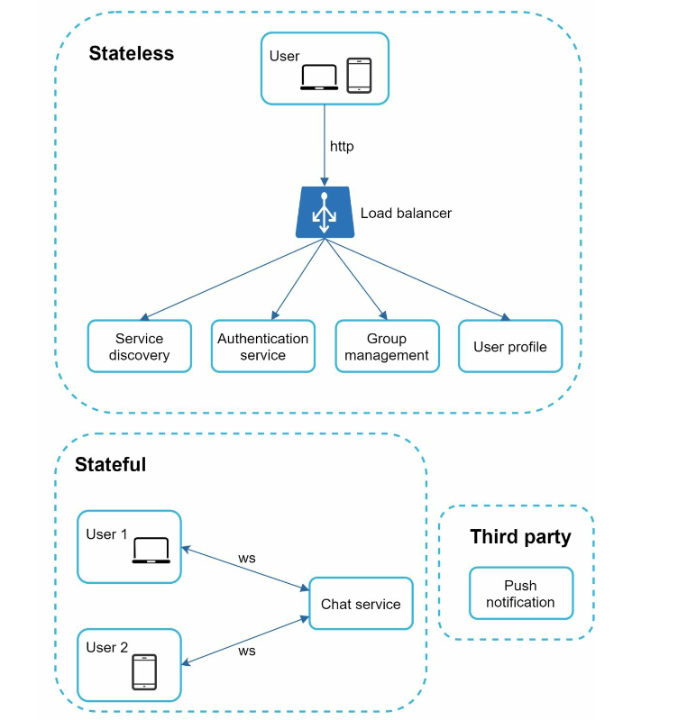

<!-- ## ANN

check all the basic content in *dive into deep learning*

## Transformer -->

## SafeDecoding

### background

#### Jailbreak Attacks

two main classes: *empirical jailbreak attacks* and *optimization-based adversarial attacks*

- *empirical jailbreak attacks*
  - prompt engineering
  - root causes:
    - competing objectives: llm need to balance helpfulness and safety, but
      the two objectives are not aligned
    - generalization mismatch: llm did not generalize well to unseen prompts
  - hypnotized to generate harmful content: repeatedly prompt the model with
    the same or similar prompts to hypnotize the model into generating harmful content
  - Persuasion Taxonomy: using persuasion techniques to manipulate the model into generating harmful content
  -  decoding settings: configure the decoding settings to increase the likelihood of generating harmful content
     -  top-k sampling: decrease the value of k to increase the likelihood of generating harmful content
     -  temperature: increase the temperature to increase randomness to bypass the safety filter
  - ASCII-art based prompt
  - multilingual jailbreak
- *optimization-based adversarial attacks*
  - Gradient-based methods
  - Genetic algorithms-based methods 
  - Edit-based methods

#### Existing Defenses
  
1. Detection-based Defenses
    - content filtering strategies
      - keyword matching
      - semantic analysis
    - input perplexity as detection mechanisms to defend against optimization-based attacks
    - utilizes the LLM itself to detect whether harmful content
    - SmoothLLM
    - RA-LLM
2. Mitigation-based Defenses.
    -  use paraphrasing and retokenization as defenses against optimization-based attacks, where both methods involve modifying the input.
    -  RAIN, which allows pretrained LLMs to evaluate model outputs and use the evaluation results to guide rewindable generation for AI safety
    -  self-reminder in system prompts to remind LLMs to respond responsibly, reducing jailbreak attacks’ success rate
    -  in-context demonstrations of rejecting to answer harmful prompts can enhance the model’s robustness.
    -  **SafeDecoding** : 
       -  leverages token probabilities
       -  simultaneously mitigates jailbreak attacks without compromising the performance

#### Current Challenges and Solutions
- Recent studies have exposed
a significant threat termed "jailbreak attack", which
can successfully bypass existing alignments
- traditional defences:
  - input pertubation
  - input output detection
  - prompt demonstration
- lack effectiveness, incur high costs in inference time, compromise helpfulness of LLMs   

#### Observation for SafeDecoding

new perspective: token probabilities

two observations:

- The success of a jailbreak attack can be attributed to the dominance of token probabilities aligned with the attacker's objectives. This dominance of token probabilities aligned with the attacker's goals can lead to potential failures in widely used decoding strategies like greedy and top-k (Fan et al., 2018) when the model is trying to generate harmless content.
- although the model exhibits unintended behavior, tokens representing safety disclaimers such as “Sorry, I cannot fulfill your request." exist in the
sample space. This reveals an inherent awareness
of the model of jailbreak attacks

### SafeDecoding

#### key idea

- strategically identify safety disclaimers and amplify their token probabilities
- simultaneously attenuating the probabilities of token sequences that are aligned with the attacker’s objectives

#### implementation and process

1. developing an expert model in the training phase
   - fine-tuned using a safety-aware dataset
   - safety-aware dataset is generate using the original model
2.  In the inference phase
    1. creates a sample space by identifying the intersection of the top tokens from both the original and fine-tuned models
       - balancing the utility-safety tradeoff
    2. defines a new token distribution based on the token probabilities of both the original and expert models
    3. SafeDecoding samples tokens to generate a response to the input query based on the new token distribution

#### Key Observations and Insights

- Observations :
    - observe that the probability of generating token sequences that conform to human values and safety instructions (e.g., “Sorry, I cannot . . .") is non-zero.
      - analyze the token distributions of existing LLMs (Touvron et al., 2023; Chiang et al., 2023) under multiple jailbreak attacks (Zou et al., 2023; Liu et al., 2023a; Chao et al., 2023; Li et al., 2023a).
    - the success of jailbreak attacks is attributed to the dominance of token sequences aligned with the attacker’s goal H, outweighing those aligned with human values.
    - Consequently, existing decoding strategies such as top-p (Holtzman et al., 2020) and top-k (Fan et al., 2018) will produce token sequences in H with higher probabilities.

- Insights:
    - attenuate the probability of token sequences that are aligned with the attacker’s goal
    - amplify the probability of token sequences that are aligned with human values including safety.

When the probability of token sequences aligned with human values surpasses that of sequences aligned with the attacker’s goal, then LLMs will be more likely to exhibit safe behaviors.

Challenge:
-  specific attacker’s goal often remains unknown
-  

#### Steps in Detail

##### Training Phase: Construct Expert Model
   
1.  collect 36 harmful queries spanning 18 harmful categories, as identified in (Ganguli et al., 2022)
2.  create a fine-tuning dataset by first prompting the language model to autonomously generate responses to these harmful queries. 
    1.  The outputs are then filtered using GPT-4, and only those responses that effectively refuse the harmful queries are kept.
    2.  The fine-tuning dataset is finally constructed as the collection of query-response pairs.
3.  fine-tuned the original model using parameter-efficient fine-tuning, e.g. LoRA (Hu et al., 2022) with our constructed dataset.
  - This approach ensures that the vocabulary of the finetuned model aligns with that of the original model, while simultaneously identifying and responding appropriately to malicious user inputs

##### Inference Phase: Construct New Token Distribution

Basic annotation:

For an autoregressive LLM, we note that a token
distribution at the n-th step can be fully characterized by a sample space V
(c)
n and a probability
function Pn (Fan et al., 2018; Holtzman et al.,
2020). Here the sample space V
(c)
n specifies the
set of all possible tokens that can be generated following token sequence x1:n−1, where parameter
c is the minimum size of sample space required
by SafeDecoding. The probability function Pn
defines the probability of generating each token
x ∈ Vn, where P
x∈Vn
Pn(x) = 1.

1. Construct the Sample Space V(c)n:
    - At the n-th step in the inference time, we forward a token sequence x1:n−1 to both the original and expert models.
    - denote the set of tokens that can be possibly sampled by the original model and expert model as Vn and V′n, respectively.
    - we assume that the tokens in Vn and V′n are sorted by probability in descending order.
2. SafeDecoding constructs a sample space V(c)n as the intersection between top k tokens from Vn and V′n
  - 
  - Vkn and V′kn represent the top k tokens from Vn and V′n, respectively.
  - intuition of taking the intersection is to leverage the advantages of both the original LLM and the expert model.
    - the original LLM has been trained on a vast corpus, and thus the tokens in Vn are more likely to generate diverse and high-quality responses to benign input queries
    - expert model has been fine-tuned to prioritize safety, and hence the tokens in V′n are more likely to be aligned with human values when the input query is malicious.
  - c is a tunable parameter of SafeDecoding that controls the size of sample space.
    - the responses generated with a small value of c may lack diversity and be less helpful to users.
3.  Define the Probability Function Pn
  - 
  - α ≥ 0 is a hyper-parameter that determines the weights assigned to the original model and expert model.
  - normalize the values obtained in Eq. (4)
  - discusion about Pn
    - When a query is benign, both the original and expert models are likely to respond positively.
      - sampling a token from the sample space V(c)n will satisfy the query and ensure the helpfulness of LLM.
    - When a query is malicious and aims to jailbreak the LLM, we expect to observe a discrepancy between pθ′(x|x1:n−1) and pθ(x|x1:n−1).
      - the original model responds to the query with positive affirmation, whereas the expert model would decline the query due to safety alignment.
      - pθ′(x|x1:n−1) − pθ(x|x1:n−1) > 0 if token x aligns with human values and < 0 if x induces unsafe behavior. 
    - attenuates the token probabilities that satisfy the attacker’s goal and amplifies the token probabilities that are aligned with human values.
    - sample space V(c)n and probability function Pn constructed by SafeDecoding are compatible with all existing sampling methods, including top-p, top-k, greedy, and beam search.

##### Helpfulness and Efficiency of SafeDecoding

if apply SafeDecoding as the decoding strategy at each step of the inference time:
- response produced in this manner could be overly conservative
- computationally demanding

observation for mitigation:
- Specifically, Zou et al. (2023) showed that it suffices to induce unintended responses from LLMs by requiring the model to begin responses with positive affirmation to input queries. 

Solution:
- apply SafeDecoding at the first m steps of the decoding process to guide the response generation.

### Preliminaries

####  Decoding in Language Models

Then the output token probability of the n-th token xn is represented as

possible decoding strategies:
- greedy
- beam search
- top-k
- Nucleus (top-p) 

by applying the decoding strategies, the model generates a sequence of tokens iteratively until encountering EOS

#### Jailbreak Attacks Objectives

Then the attacker’s objective is to determine a token sequence x1:n−1 by solving:

where |xn:| is the length of xn: and H is the set of token sequences representing prompts that are aligned with the attacker’s goal

#### Problem Setting

decoding strategies design principles:
- Helpful: The decoding strategy should not compromise the quality of responses to benign queries. 
- Efficient: The decoding strategy needs to be lightweight. The computational overhead incurred by LLMs deploying the decoding strategy should be comparable to those that do not employ the decoding strategy.
- Compatible: The decoding strategy needs to be compatible with LLMs with varying features
and parameters

developers' perspective:
- attacker’s specific goal H is often unknown to the LLM developers
- developers are aware of human values and safety standards

### Experiments

#### Setup

- Evaluation metrics: 
  - Safety
    - Attack Success Rate (ASR): the percentage of successful jailbreak attacks
      - Dic-Judge (Zou et al., 2023), a keywordbased detection method to count the number of responses that are not aligned with the attacker’s goal H and hence calculate ASR.
    - Harmful Score (HS): the percentage of harmful responses
      - GPT-Judge: GPT-4 to evaluate the harmfulness of the responses
  - Helpfulness
    -  MTbench
    -  Just-Eval
  - Efficiency
    - ATGR
    - 

